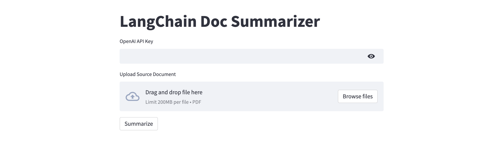

# langchain-chroma-summary



A simple and efficient PDF document summarizer built using **LangChain**, **Chroma VectorDB**, **OpenAI's LLM APIs**, and **Streamlit** for an interactive web UI. Upload a PDF, and get a clean AI-generated summary powered by vector similarity search and language models.

---

## 🚀 Features

- 📄 Upload PDFs and automatically split them into pages.
- 🔍 Embed and store document pages in a **Chroma vector database** using OpenAI embeddings.
- 🤖 Use **LangChain Summarize Chain** with an OpenAI chat model to generate concise summaries.
- 🌐 Clean and minimal **Streamlit UI** for easy interaction.
- 🔐 API key input via sidebar for secure access to OpenAI services.

---

## 📦 Installation

### 1️⃣ Clone the Repository

```bash
git clone https://github.com/blunterdecosta123/langchain-chroma-summary.git
cd langchain-chroma-summary
```

### 2️⃣ Install Dependencies

It's recommended to use a virtual environment:

```bash
python -m venv venv
source venv/bin/activate  # On Windows: venv\Scripts\activate
pip install -r requirements.txt
```

### 🖥️ How to Use

Run the Streamlit app:

```bash
streamlit run streamlit_app.py
```

Enter your OpenAI API Key

Upload a PDF document

Click Summarize and let the app do its magic ✨